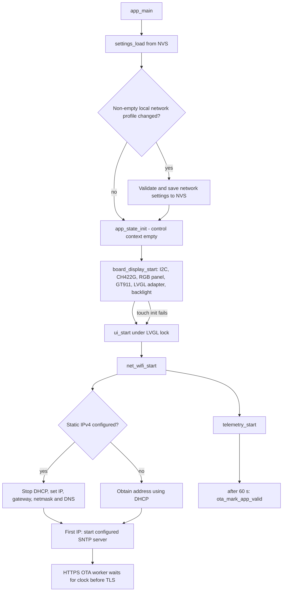
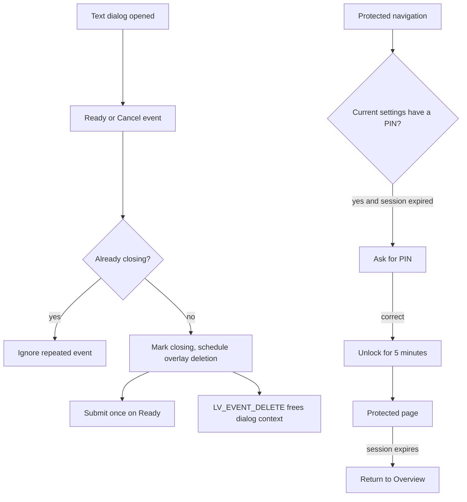

# Boot flow

```mermaid
flowchart TD
    A["app_main"] --> B["settings_load from NVS"]
    B --> Profile{"Non-empty local network profile changed?"}
    Profile -->|yes| Save["Validate and save network settings to NVS"]
    Profile -->|no| C["app_state_init - control context empty"]
    Save --> C
    C --> D["board_display_start: I2C, CH422G, RGB panel, GT911, LVGL adapter, backlight"]
    D --> E["ui_start under LVGL lock"]
    E --> F["net_wifi_start"]
    F --> G["telemetry_start"]
    F --> Mode{"Static IPv4 configured?"}
    Mode -->|yes| Static["Stop DHCP, set IP, gateway, netmask and DNS"]
    Mode -->|no| DHCP["Obtain address using DHCP"]
    Static --> I["First IP: start configured SNTP server"]
    DHCP --> I
    I --> J["HTTPS OTA worker waits for clock before TLS"]
    G --> H["after 60 s: ota_mark_app_valid"]
    D -- "touch init fails" --> E
```

```mermaid
flowchart TD
    Open["Text dialog opened"] --> Ready["Ready or Cancel event"]
    Ready --> Closing{"Already closing?"}
    Closing -->|yes| Ignore["Ignore repeated event"]
    Closing -->|no| Mark["Mark closing, schedule overlay deletion"]
    Mark --> Callback["Submit once on Ready"]
    Mark --> Delete["LV_EVENT_DELETE frees dialog context"]
    Nav["Protected navigation"] --> Pin{"Current settings have a PIN?"}
    Pin -->|yes and session expired| Entry["Ask for PIN"]
    Entry -->|correct| Unlock["Unlock for 5 minutes"]
    Unlock --> Page["Protected page"]
    Page -->|session expires| Home["Return to Overview"]
```
