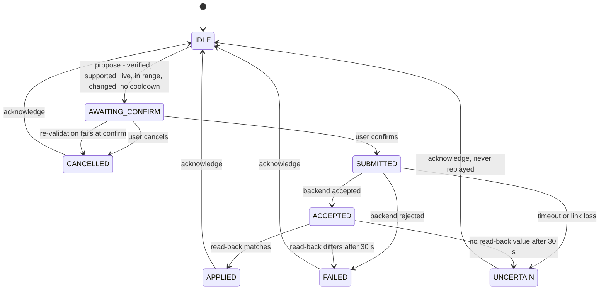

# Control command lifecycle

All parameters ship unverified, so `ctrl_can_edit` blocks at the first step.

```mermaid
stateDiagram-v2
    [*] --> IDLE
    IDLE --> AWAITING_CONFIRM: propose - verified, supported, live, in range, changed, no cooldown
    AWAITING_CONFIRM --> CANCELLED: user cancels
    AWAITING_CONFIRM --> CANCELLED: re-validation fails at confirm
    AWAITING_CONFIRM --> SUBMITTED: user confirms
    SUBMITTED --> ACCEPTED: backend accepted
    SUBMITTED --> FAILED: backend rejected
    SUBMITTED --> UNCERTAIN: timeout or link loss
    ACCEPTED --> APPLIED: read-back matches
    ACCEPTED --> FAILED: read-back differs after 30 s
    ACCEPTED --> UNCERTAIN: no read-back value after 30 s
    APPLIED --> IDLE: acknowledge
    FAILED --> IDLE: acknowledge
    UNCERTAIN --> IDLE: acknowledge, never replayed
    CANCELLED --> IDLE: acknowledge
```
