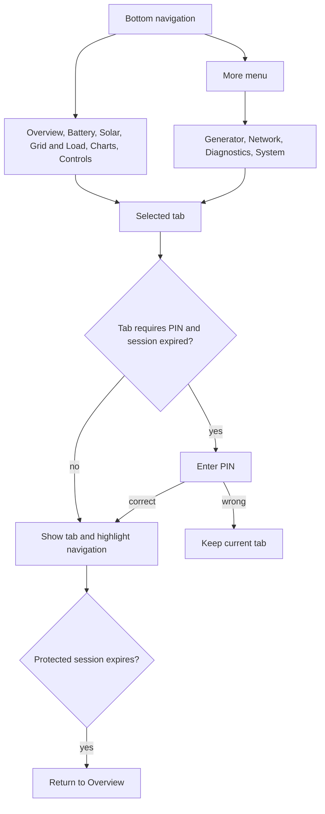

# Bottom navigation

```mermaid
flowchart TD
    Nav["Bottom navigation"] --> Direct["Overview, Battery, Solar, Grid and Load, Charts, Controls"]
    Nav --> More["More menu"]
    More --> Extra["Generator, Network, Diagnostics, System"]
    Direct --> Target["Selected tab"]
    Extra --> Target
    Target --> Protected{"Tab requires PIN and session expired?"}
    Protected -->|no| Show["Show tab and highlight navigation"]
    Protected -->|yes| Prompt["Enter PIN"]
    Prompt -->|correct| Show
    Prompt -->|wrong| Stay["Keep current tab"]
    Show --> Expiry{"Protected session expires?"}
    Expiry -->|yes| Overview["Return to Overview"]
```
