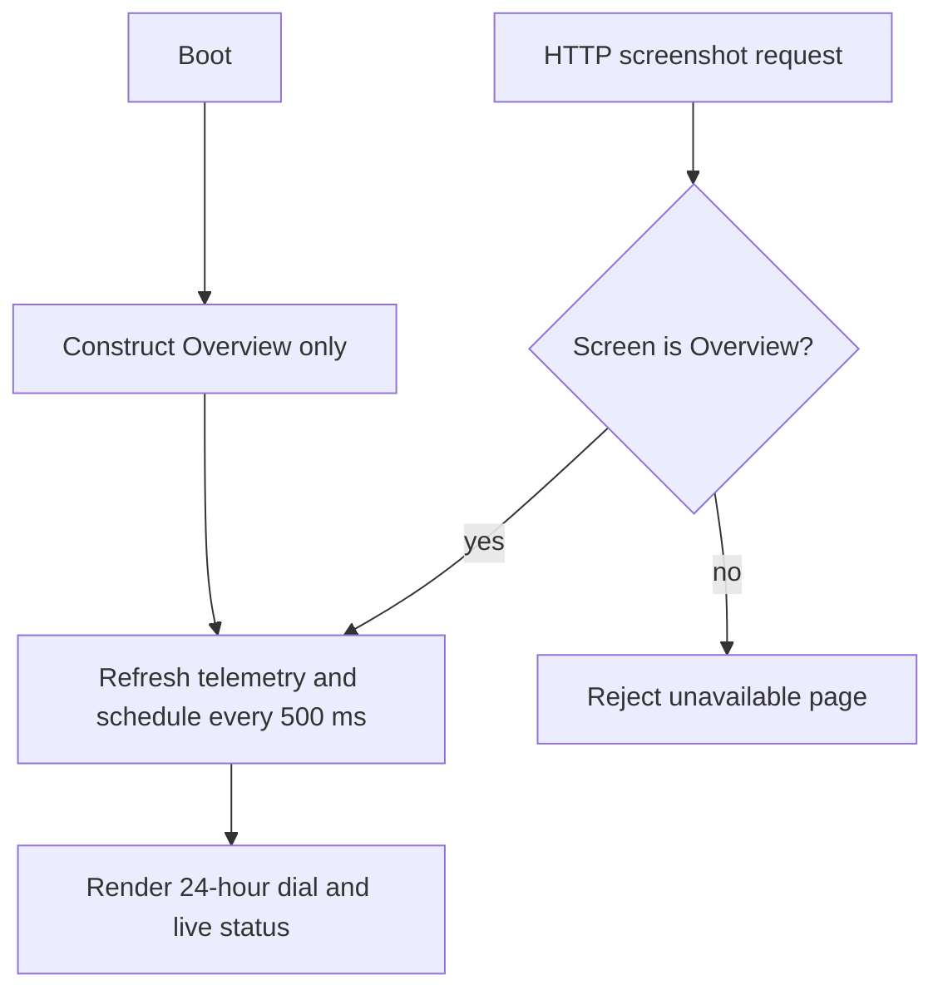

# Single-screen Overview

```mermaid
flowchart TD
    Boot["Boot"] --> Create["Construct Overview only"]
    Create --> Refresh["Refresh telemetry and schedule every 500 ms"]
    Refresh --> Show["Render 24-hour dial and live status"]
    Capture["HTTP screenshot request"] --> Select{"Screen is Overview?"}
    Select -->|yes| Refresh
    Select -->|no| Reject["Reject unavailable page"]
```
