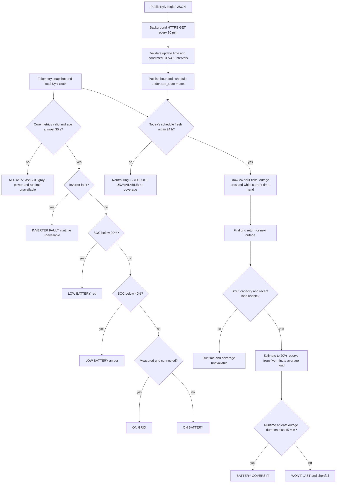

# Overview state and estimate

```mermaid
flowchart TD
    Snapshot["Telemetry snapshot and local Kyiv clock"] --> Live{"Core metrics valid and age at most 30 s?"}
    Live -->|no| NoData["NO DATA; last SOC gray; power and runtime unavailable"]
    Live -->|yes| Fault{"Inverter fault?"}
    Fault -->|yes| FaultView["INVERTER FAULT; runtime unavailable"]
    Fault -->|no| Critical{"SOC below 20%?"}
    Critical -->|yes| CriticalView["LOW BATTERY red"]
    Critical -->|no| Low{"SOC below 40%?"}
    Low -->|yes| LowView["LOW BATTERY amber"]
    Low -->|no| Grid{"Measured grid connected?"}
    Grid -->|yes| GridView["ON GRID"]
    Grid -->|no| BatteryView["ON BATTERY"]
    Mirror["Public Kyiv-region JSON"] --> Fetch["Background HTTPS GET every 10 min"]
    Fetch --> Parse["Validate update time and confirmed GPV4.1 intervals"]
    Parse --> Cache["Publish bounded schedule under app_state mutex"]
    Cache --> Schedule{"Today's schedule fresh within 24 h?"}
    Snapshot --> Schedule
    Schedule -->|no| Unavailable["Neutral ring; SCHEDULE UNAVAILABLE; no coverage"]
    Schedule -->|yes| Dial["Draw 24-hour ticks, outage arcs and white current-time hand"]
    Dial --> Event["Find grid return or next outage"]
    Event --> Estimate{"SOC, capacity and recent load usable?"}
    Estimate -->|no| NoEstimate["Runtime and coverage unavailable"]
    Estimate -->|yes| Runtime["Estimate to 20% reserve from five-minute average load"]
    Runtime --> Coverage{"Runtime at least outage duration plus 15 min?"}
    Coverage -->|yes| Covers["BATTERY COVERS IT"]
    Coverage -->|no| Short["WON'T LAST and shortfall"]
```
