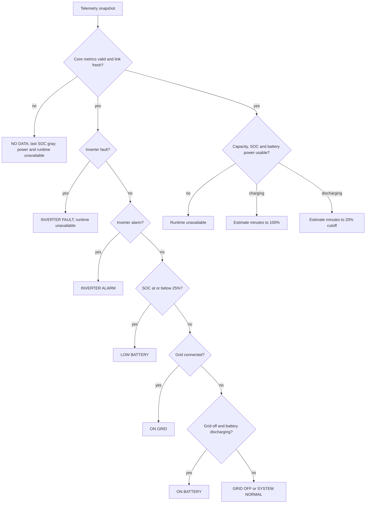

# Overview state and estimate

```mermaid
flowchart TD
    Snapshot["Telemetry snapshot"] --> Live{"Core metrics valid and link fresh?"}
    Live -->|no| NoData["NO DATA; last SOC gray; power and runtime unavailable"]
    Live -->|yes| Fault{"Inverter fault?"}
    Fault -->|yes| FaultView["INVERTER FAULT; runtime unavailable"]
    Fault -->|no| Alarm{"Inverter alarm?"}
    Alarm -->|yes| AlarmView["INVERTER ALARM"]
    Alarm -->|no| Low{"SOC at or below 25%?"}
    Low -->|yes| LowView["LOW BATTERY"]
    Low -->|no| Grid{"Grid connected?"}
    Grid -->|yes| GridView["ON GRID"]
    Grid -->|no| Discharge{"Grid off and battery discharging?"}
    Discharge -->|yes| BatteryView["ON BATTERY"]
    Discharge -->|no| GridOff["GRID OFF or SYSTEM NORMAL"]
    Live -->|yes| Estimate{"Capacity, SOC and battery power usable?"}
    Estimate -->|no| NoEstimate["Runtime unavailable"]
    Estimate -->|charging| Full["Estimate minutes to 100%"]
    Estimate -->|discharging| Cutoff["Estimate minutes to 20% cutoff"]
```
