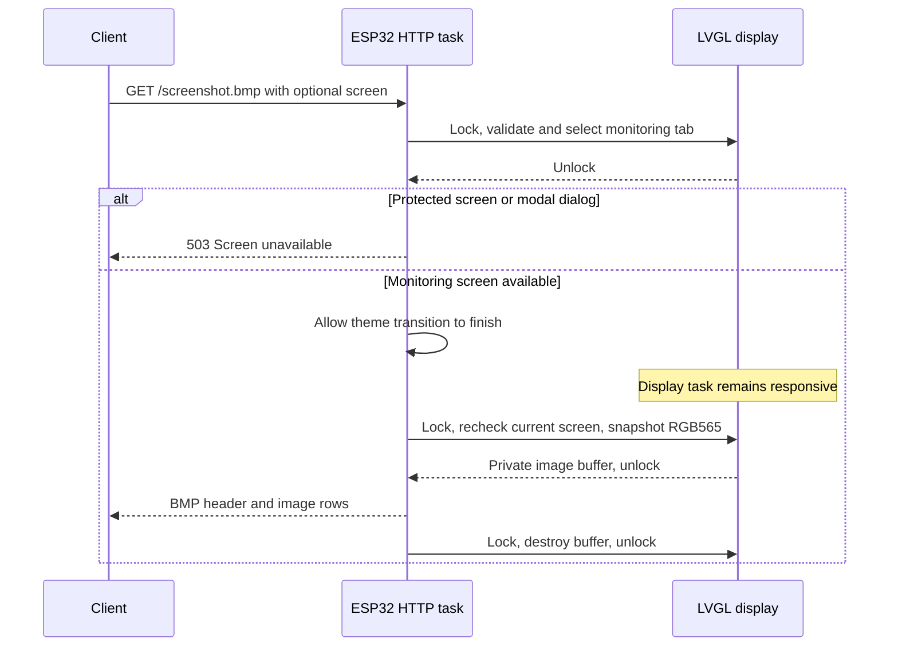

# Device screenshot flow

```mermaid
sequenceDiagram
    participant Client
    participant HTTP as ESP32 HTTP task
    participant UI as LVGL display
    Client->>HTTP: GET /screenshot.bmp with optional screen
    HTTP->>UI: Lock, validate and select monitoring tab
    UI-->>HTTP: Unlock
    alt Protected screen or modal dialog
        HTTP-->>Client: 503 Screen unavailable
    else Monitoring screen available
        HTTP->>HTTP: Allow theme transition to finish
        Note over UI: Display task remains responsive
        HTTP->>UI: Lock, recheck current screen, snapshot RGB565
        UI-->>HTTP: Private image buffer, unlock
        HTTP-->>Client: BMP header and image rows
        HTTP->>UI: Lock, destroy buffer, unlock
    end
```
