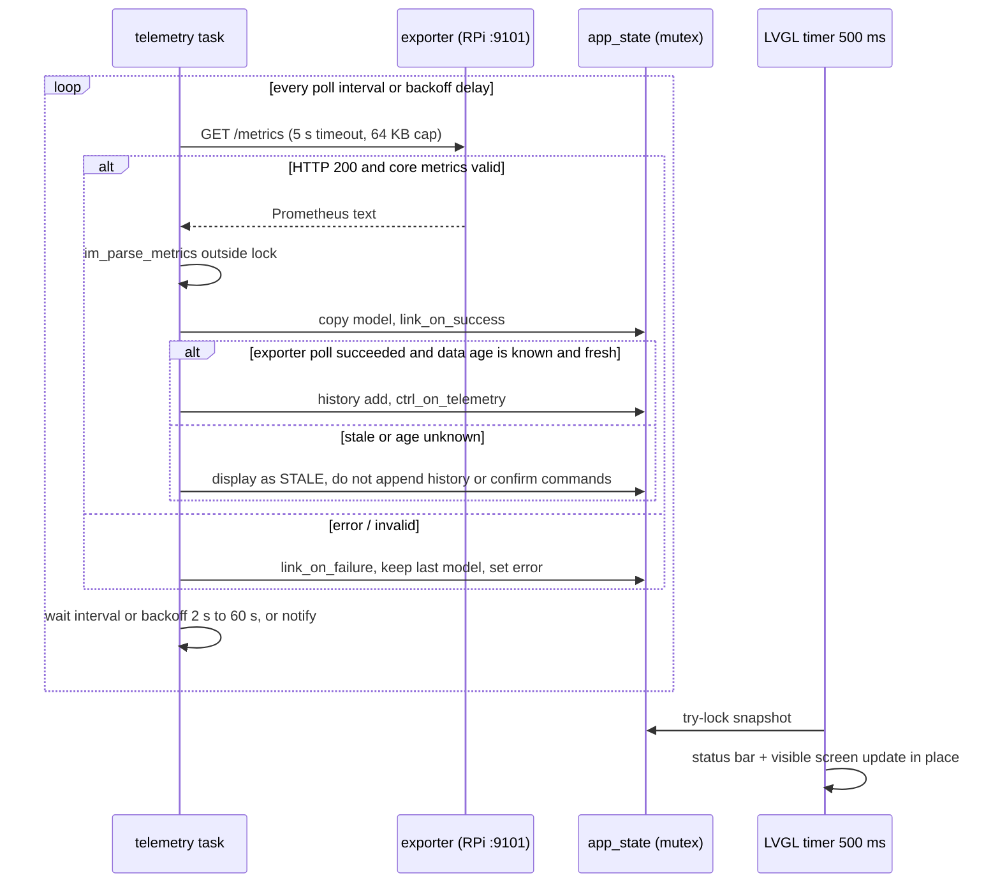
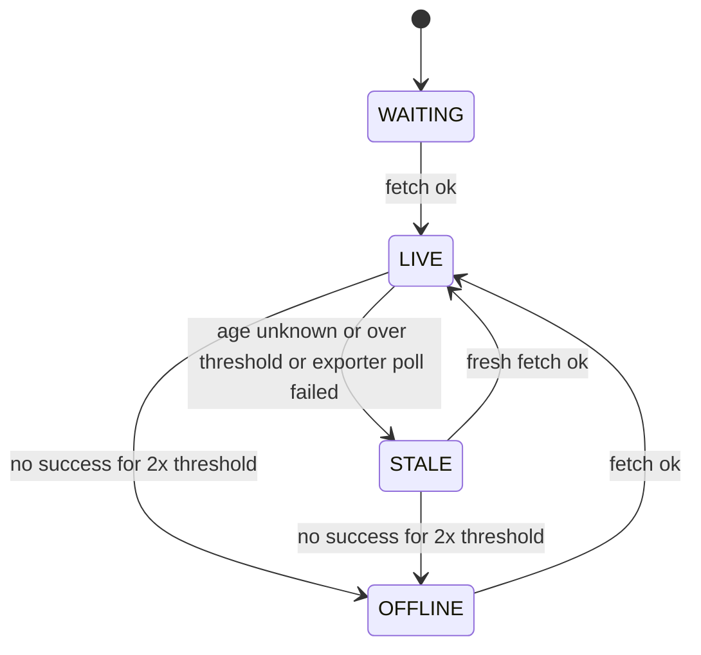

# Telemetry flow

```mermaid
sequenceDiagram
    participant T as telemetry task
    participant E as exporter (RPi :9101)
    participant S as app_state (mutex)
    participant U as LVGL timer 500 ms
    loop every poll interval or backoff delay
        T->>E: GET /metrics (5 s timeout, 64 KB cap)
        alt HTTP 200 and core metrics valid
            E-->>T: Prometheus text
            T->>T: im_parse_metrics outside lock
            T->>S: copy model, link_on_success
            alt exporter poll succeeded and data age is known and fresh
                T->>S: history add, ctrl_on_telemetry
            else stale or age unknown
                T->>S: display as STALE, do not append history or confirm commands
            end
        else error / invalid
            T->>S: link_on_failure, keep last model, set error
        end
        T->>T: wait interval or backoff 2 s to 60 s, or notify
    end
    U->>S: try-lock snapshot
    U->>U: status bar + visible screen update in place
```

```mermaid
stateDiagram-v2
    [*] --> WAITING
    WAITING --> LIVE: fetch ok
    LIVE --> STALE: age unknown or over threshold or exporter poll failed
    STALE --> LIVE: fresh fetch ok
    LIVE --> OFFLINE: no success for 2x threshold
    STALE --> OFFLINE: no success for 2x threshold
    OFFLINE --> LIVE: fetch ok
```
